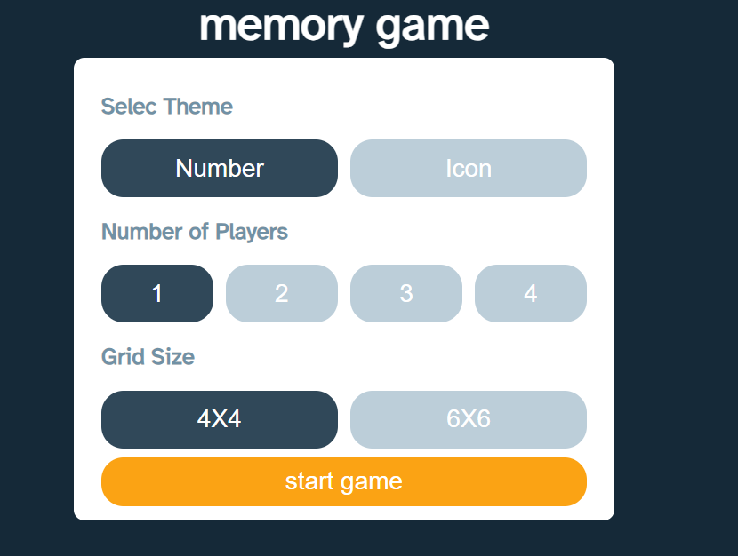
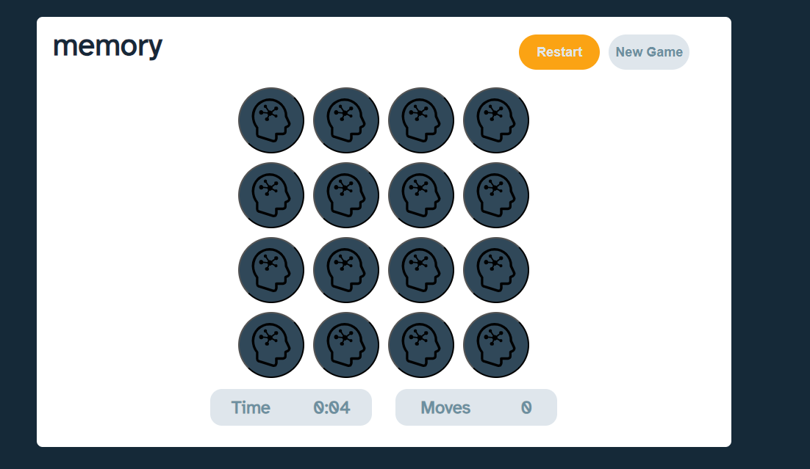
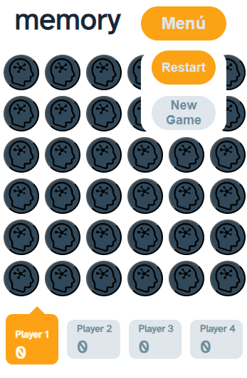
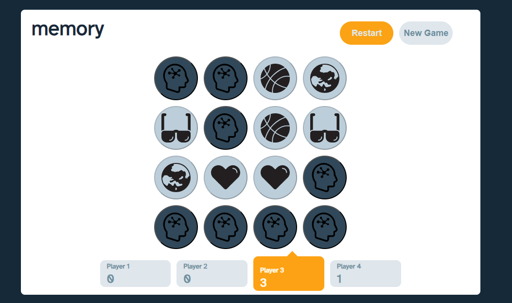
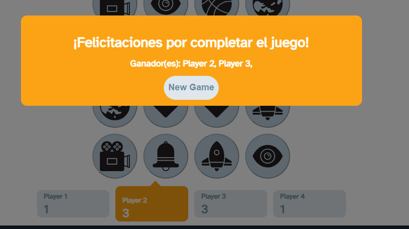
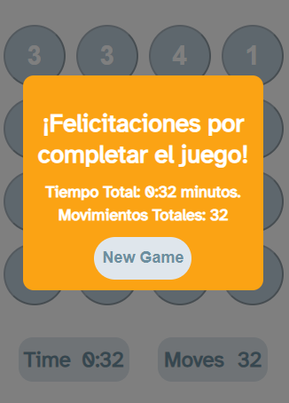

# Memory Game - React Js

## Table of Contents
1. [Informacion General](#general-info)
2. [Requisitos Previos](#requisitos-previos)
3. [Configuracion Inicial](#configuración-inicial)
4. [Ejecutar la aplicacion](#ejecutar-la-aplicación)
5. [Uso de la aplicaicon](#uso-de-la-aplicación)
#

## **Información General**

Este proyecto es una aplicación de juego de memoria desarrollada con ReactJS. El juego permite a los jugadores elegir entre cartas con números o iconos, configurar el tamaño de la grilla de cartas y seleccionar el número de jugadores (de 1 a 4 jugadores). Si se juega con un solo jugador, se mostrará un temporizador y un contador de movimientos. Al final de la partida, se mostrará un modal con el resultado de la partida, incluido el tiempo y el número de movimientos realizados. Si se juega con más de un jugador, se irán sumando puntos al conseguir parejas de cartas. Al final, en el modal, se mostrará el jugador con más movimientos o ambos jugadores en caso de empate.


#

## **Requisitos Previos**

- **Node.js:** Asegúrate de tener Node.js instalado en tu sistema. Puedes descargarlo desde https://nodejs.org.

- **Yarn:** Asegúrate de tener Yarn instalado en tu sistema. Puedes encontrar instrucciones de instalación en https://yarnpkg.com.
#

## **Configuración Inicial**

1. Clona o descarga este repositorio.

2. Navega hasta el directorio del proyecto en tu terminal.

3. Ejecuta el siguiente comando para instalar las dependencias necesarias:

```
yarn install
````
#

## **Ejecutar la aplicación**

1. Después de completar la configuración inicial, ejecuta el siguiente comando para iniciar la aplicación:

<!-- Copy code -->
```
yarn dev
```

## **Uso de la aplicación**

Para usar la aplicacion debes entrar al siguiente link: [Memory Game ](https://memorygame-cpineda.netlify.app/)

- Al abrir la aplicación, verás una pantalla de configuracion en la cual puedes seleccionar las distintas maneras de juego que se encuentran.

    Desde numeros o iconos en las cards, dos tamaños de tableros, en este caso 4x4 y 6x6, y donde pondras seleccionar hasta 4 jugadores.


- Si al momento de seleccionar tu modo de juego se escoge un solo jugador, ya sea con iconos o numeros, tamaño 4x4 o 6x6, en la vista del juego apareceran el numero de cards del tamaño del tablero y en la parte inferios apareceran un timer, el cual va llevando el tiempo que llevas de juego y un contador de movimientos que ira sumando dependiendo de los movimientos realizados. Cabe resaltar que cada vez que se hace girar una card, cuenta como un movimiento, es decir encontrar una pareja te cuesta dos movimientos.



- La pantalla dde juego, cuenta dos botones en la parte superior, los cuales son "Restart" que reestablece todo el juego con timer y movimientos incluidos, y a su vez vuelve a mezclar todas las cards. Y el boton "New Game" el cual de redirige a la pagina de configuracion para escoger el nuevo juego. Asi mismo, estos botones en version mobile estan inclidos dentro de un boton menu para ocupar menos espacio y brindar mejor interaccion con el usuario.



- Si al momento de configurar el juego se escogen mas de dos jugadores, el timer y el contador de movimientos desapareceran y se incluirá un nuevo componente el cual mostrara el numero de jugadores seleccionados de manera independiente, es decir, cada jugador tiene su turno, y cada jugador va sumando sus puntos a medida de que se vayan descubriendo las parejas de las cards. El jugador que tenga el turno asignado, estara de color naranja mientras que los que esten esperando su turno estaran de color gris, asi mismo los botones "Restart" y "New Game" cumpliran sus mismas funciones.




- El juego Termina el momento en que se esncuentran todas las parejas de las cards. En caso tal estes en modo multijugador, aparecera un modal el cual indica que jugador optuvo la mayoria de puntos y gano el juego.



- En el caso de que se este jugando solo, aparecera el mismo modal pero indicando este el tiempo en el que se completo el juego y la cantidad de movimientos realizada.




¡Disfruta usando la aplicación del juego de memoria! Si tienes alguna pregunta, problema o aporte, no dudes en consultar la documentación o [contactar al desarrollador](https://www.linkedin.com/in/cristian-pineda17/).